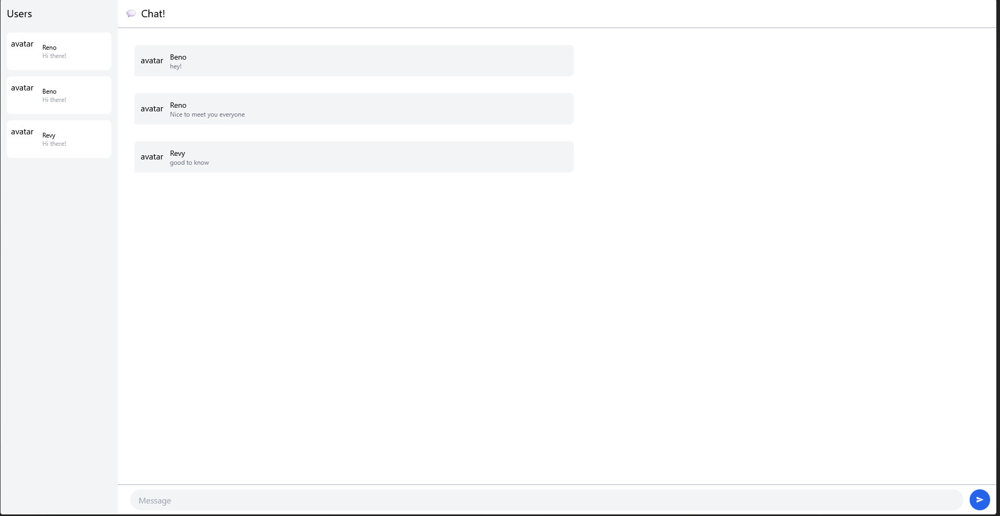

### Original Code

### Be Creative

For my creative work, i decided to add a background for the login page, and interactive buttons where they move when you hover over them. This also applies when you hover over users in the chatroom itself, they do a slight gesture movement. This is to increase interactivity with the website and its buttons. 